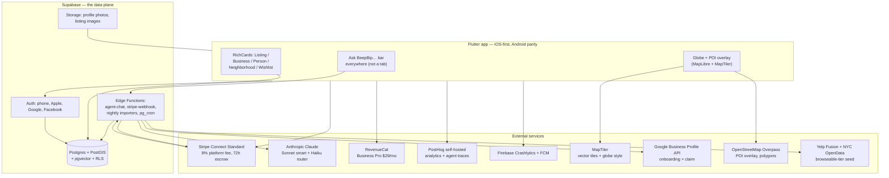

# BEEPBIP — Co-founder brief

> **Audience:** the third co-founder (and any close advisor) who hasn't been in the build day-to-day.
> **Goal:** a single document that takes ~15 minutes to read and leaves you with a complete, opinionated picture of the MVP plan, the architecture, what's already shipped, what's still pending, and the decisions that need your input.
> **Status:** living document — last updated 2026-05-04. Source of truth for everything detailed in here is `docs/MVP_SPEC.md`; pointers are inline.

---

## 0. TL;DR

We are building **an agent-native neighborhood marketplace for SoHo, Manhattan**, with five surrounding NYC neighborhoods seeded as a "browseable tier" for cross-neighborhood reach. Users discover, book, and pay verified local businesses; trust comes from escrow + a 3-tier feedback layer; the discovery surface itself is **conversational** — every screen exposes an "Ask BeepBip…" bar that translates fuzzy intent into structured queries against verified inventory.

- **Stack:** Flutter + Supabase + Stripe Connect + Anthropic Claude + MapTiler/MapLibre globe.
- **Business model:** 8% transaction fee + Business Pro at $29/mo (14-day trial).
- **Launch:** SoHo POC public in ~8 weeks (Phases 0–6); agent + 5-neighborhood browseable tier behind feature flags 4 weeks after (Phases 7–8).
- **Money:** $600K SAFE for 18 months runway (`docs/INVESTOR_ONE_PAGER.md`).
- **What you (third co-founder) own end-to-end this round:** **SoHo go-to-market** (50 verified businesses + 500 onboarded consumers in 12 weeks), the **Apple Developer enrollment** (Shai), and a handful of founder decisions listed in §6 below.

The full canonical engineering spec is `docs/MVP_SPEC.md` (≈1,600 lines). This brief is the reading order *into* that spec.

---

## 1. The product in one screen

**One sentence to the user:** *"SoHo's best, booked and paid in one tap — with your money protected until you're happy. Just ask."*

Five things together make this genuinely new (none individually, all together):

1. **Agent as the discovery surface.** ChatGPT can't book a SoHo baker; Yelp can't answer "I just moved here, I love vinyl and Sunday brunch — who do I meet?" Our agent can do both because it has tools backed by real verified inventory and a real people graph.
2. **Implicit-then-explicit communities** mined from agent conversation logs. We don't ship empty community pages; communities emerge from the questions real users repeatedly ask.
3. **B2B + B2C in one local graph.** A SoHo baker looking for organic flour and a SoHo resident looking for sourdough live in the same neighborhood graph and the same agent serves both.
4. **Two-tier neighborhood model.** SoHo is "Live" (full transactions). 5 surrounding NYC neighborhoods are "Browseable" (public-data businesses, claim-this-business CTA). Every browseable click is a demand signal that tells us where to launch next.
5. **Serial id `BP-XXXXXX` as a graph portal.** Every chip in the app is a doorway: tap → see your overlap, shared communities, shared interests with that node. The id stops being a label and becomes navigation.

**Explicitly NOT building:** infinite-scroll feed, follower system, algorithmic ranking, multi-language, multi-currency, autonomous agent actions, chat tab, named communities (V1.5), Stripe Invoices for B2B (V2). We are not Instagram, not Nextdoor, and not ChatGPT.

> **Where to dig in:** `docs/AGENT_NARRATIVE.md` for the differentiation story, `docs/MVP_SPEC.md` §1–§3 for the full product surface, `beepbip-mockup.html` for the 5-screen mockup.

---

## 2. The architecture at a glance

- **Mobile** (Flutter) is the only client surface in V1. Web is read-only marketing + share links.
- **Supabase** is the entire backend. RLS gates reads; Edge Functions handle Stripe webhooks, the agent runtime, the nightly importers (browseable-tier businesses + POI overlay + GMB resync), pg_cron jobs (escrow auto-release, hashtag co-occurrence refresh, social-import-candidate reaper).
- **Stripe Connect (Standard)** is our payment rails. 8% platform fee. Escrow is software-only (capture → 72h auto-release on completion).
- **Anthropic Claude** runs the agent. Tiered routing (Haiku for ~70% of intents, Sonnet only when needed) + prompt caching keeps the cost line at $300–800/mo at 100k MAU.

> **Where to dig in:** `docs/MVP_SPEC.md` §4 (full architecture, error model, offline strategy), §4.7 (agent runtime), §4.7a (globe map runtime), §5 (data model + RLS).

---

## 3. What's already shipped and verified working

(All dates and verifications come from `docs/STATE.md` and the Git history in `Shaus12/beepBip1.0`.)

### 3.1 Foundation
- ✅ **Supabase staging** (`vjtqfmkqvxmqzztbndoo`, US-East) created, all 12 migrations + reference data pushed (2026-04-18).
- ✅ **Email/password auth** signup → confirm-email → login flow against staging Supabase. Resend SMTP wired.
- ✅ **Listings vertical end-to-end** (Domain → Data → Application → Presentation): create / browse / detail / edit. Image upload working (RLS-protected Storage bucket).
- ✅ **Posts vertical end-to-end** with Public/Unlisted visibility model, banned-hashtags client + server enforcement, schema-aligned compose screen, neighborhood feed.
- ✅ **Business Page MVP**: cover / logo / hashtags / hours / contact / social handles / Stripe Connect banner. Owner editor + public viewer routes wired in `app_router.dart`. Photos strip aggregates from listing images. Catalog tabs by Service / Item / Event.
- ✅ **Stripe Connect Edge Functions**: `create-stripe-connect-account`, `create-booking-checkout` (auth-validated, server-computed totals + 8% platform fee, Connect transfer), `stripe-webhook` (idempotent, handles `checkout.session.completed`, `payment_intent.succeeded`, `account.updated`, `charge.refunded`).
- ✅ **Booking flow foundation**: CTA on `ListingDetailScreen` wired to checkout function, gated behind `bookings.enabled` feature flag (default OFF). Demo mode short-circuits to a polished mock sheet (`BookingDemoSheet`) so we can demo without live Stripe credentials.
- ✅ **Brand color system locked.** Amber-on-vantablack identity, full palette + typography in `lib/core/theme/app_theme.dart` and documented in `MVP_SPEC.md` §3.14a.

### 3.2 What it adds up to
At the time of this brief (2026-05-04) the SoHo POC backend is ~70% structurally complete — schema, auth, listings, posts, business pages, Stripe rails — but **none of it has been UI-smoke-verified end-to-end on staging by a human at the keyboard yet** (see §4.1 below). That is the next wedge of work.

> **Where to dig in:** `docs/STATE.md` for the latest verified-working list, `PROJECT_STATUS.md` for the older overview (somewhat out of date — `MVP_SPEC.md` and `STATE.md` are canonical).

---

## 4. What's pending (in build order)

Pulled directly from `docs/MVP_SPEC.md` §10. Effort in working days assuming one full-time vibe-coder.

### 4.1 Immediate (Phases 0–2, weeks 1–3)
- ⏳ **A1–A5 critical bug fixes** (auth provider mocked, Supabase init missing in `main.dart`, secrets in source, no flavors, in-memory posts in legacy provider).
- ⏳ **PostGIS migration** for `locations.geog`, plus seed `neighborhoods` with the SoHo polygon.
- ⏳ **Map: globe-first renderer** — swap `google_maps_flutter` for `maplibre_gl` against MapTiler vector tiles, globe projection enabled, `flutter_map` retained as raster fallback. (D-MAP-1 spike in week 1.)
- ⏳ **POI overlay** on the map — Overpass importer + `pois` table + filter chips (Coffee / Parks / Transit / Galleries / Public bathrooms).
- ⏳ **Brand color tokens** (`BrandColors` Dart constants) — eliminate inline hex codes app-wide.
- ⏳ **Onboarding — business path:** Google Business Profile (GMB) connect → category-driven curated hashtag/services menu → SoHo polygon address validation → manual fallback.
- ⏳ **Onboarding — personal path:** social-data-pull with per-field consent toggles (Apple/Google/Facebook profile photo, bio, interests, public posts) → user explicitly checks what to import.
- ⏳ **Phone OTP**, Sign in with Apple, Sign in with Google.
- ⏳ **Listings: hashtag search & filter** (GIN index already in place); **hashtag moderation** UI in admin panel.
- ⏳ **Favorites / wishlists** (§3.15) — heart on every card, profile "Wishlists" tab, "Saved places" map layer.

### 4.2 Transactions + trust (Phases 3–4, weeks 4–6)
- ⏳ Stripe Connect Standard onboarding flow live for businesses on staging.
- ⏳ Booking state machine end-to-end (`pending → accepted → paid → completed`).
- ⏳ Escrow 72h auto-release.
- ⏳ Refund + cancel flows; receipts.
- ⏳ 3-tier emoji feedback tied 1:1 to bookings.
- ⏳ Dispute intake + admin queue.
- ⏳ Booking 1:1 chat (text only, Realtime).

### 4.3 Monetization, polish, launch prep (Phases 5–6, weeks 7–8)
- ⏳ RevenueCat + Business Pro subscription (14-day trial, $29/mo, $290/yr).
- ⏳ Verification flow (ID for individuals, license for businesses).
- ⏳ Reports & block.
- ⏳ Push notifications (FCM/APNs).
- ⏳ Admin panel (Next.js on Vercel) for moderation, verifications, disputes, flags, neighborhood manager, hashtag moderation.
- ⏳ Public web share pages (listing + business URLs that render beautifully and open in app if installed).
- ⏳ App Store + Play Store submission via TestFlight + Play Internal Testing.
- ⏳ Beta with 10 SoHo businesses end-to-end.

### 4.4 Agent + browseable tier (Phases 7–8, weeks 9–13, behind feature flags)
- ⏳ Schema: `listings.audience` + B2B fields, `agent_*` tables, `user_preferences_cache` (pgvector), `hashtag_pair` materialized view, `neighborhood_waitlist`, `community_mining_candidates`, `communities` family, `profiles.discoverable`, `business_profiles.source`, `neighborhoods.tier`.
- ⏳ 11 typed agent tools as Postgres RPCs / Edge Functions.
- ⏳ `agent-chat` Edge Function with Anthropic client + tool dispatcher + per-user budget gate + PII scrubber + prompt cache.
- ⏳ `AskBeepBipBar` widget + chat sheet + RichCard renderer.
- ⏳ Chip-portal flip (D-CHIP-1).
- ⏳ Hallucination adversarial test pass.
- ⏳ Browseable-tier importer (5 neighborhoods: Williamsburg, West Village, LES, Nolita, NoHo) running nightly with rate-limit + cost guard.
- ⏳ "Unclaimed listing" badge wired into every business render site.
- ⏳ Claim-this-business flow (one-time code or GMB-shortcut for matched rows).

### 4.5 Operational / pre-launch (in parallel, founder-run)

This is what does NOT block code but DOES block public launch. Pulled from `docs/FOLLOWUPS.md` §1:

- 🔴 **Apple Developer enrollment** ($99/yr) — **owner: Shai.** D-U-N-S verification for the Florida LLC under Shai's name; 0–2 day stall risk.
- 🔴 **Google Play Console** ($25 one-time).
- 🔴 **Google Cloud project + OAuth** with `business.manage` scope verification — 2-4 weeks Google review.
- 🔴 **Stripe Connect platform application** approved for the Florida LLC. 1–2 week review.
- 🔴 **NY sales-tax marketplace-facilitator analysis** with a CPA (Florida LLC running NY marketplace) — D12 in MVP_SPEC.
- 🔴 **Terms of Service / Privacy Policy / Seller Agreement / Refund Policy / Content Moderation Policy / DMCA process** all drafted by counsel.
- 🔴 **Public-data ToS memos** for Google Places + Yelp Fusion + NYC OpenData (browseable-tier sources) — D-NBHD-2.
- 🔴 **Meta App Review scopes** for the social-data-pull (D-SOCIAL-1).
- 🔴 **Business liability insurance** ≥$1M coverage.
- 🟠 **Designer brief** for app icon + core screens + RichCard family + agent chat sheet (must work within the locked brand palette).
- 🟠 **SoHo go-to-market kit** — 150 hand-picked target businesses, outreach script, founding-100 badge, QR window stickers, press list (Time Out NY, Secret NYC, Curbed NY).

> **Where to dig in:** `docs/FOLLOWUPS.md` §1 (pre-launch blockers), §1.4 / §1.4a / §1.4b (App Store + Play Store + IAP), §1.7 (trust & moderation), §1.8 (agent / community / browseable-tier blockers), §1.9 (onboarding / map / favorites — added 2026-05-04).

---

## 5. The recent product additions (your specific list)

This section explains the eight items added during this review pass and where each lives in the spec.

| # | Addition | Where it lives in the spec | Status |
|---|---|---|---|
| 1 | **Business onboarding via Google Business Profile (formerly GMB)** — connect → auto-prefill name, address, hours, photos, category | `MVP_SPEC.md` §3.1.a, schema §5.7a (GMB sync), build plan tasks #10 + #10b | Plan locked; needs Google Cloud project + scope verification (D-GMB-1) |
| 2 | **Once a business is found, only relevant hashtags / services should surface** | `MVP_SPEC.md` §3.1.a (category-driven menu), schema §5.7a (`category_taxonomy` + `category_aliases`) | Plan locked; needs the 40-category SoHo seed |
| 3 | **Personal onboarding via social media accounts → pull data into profile + feed → with explicit permission** | `MVP_SPEC.md` §3.1.b, schema §5.7a (`social_connections`, `social_import_candidates`), build plan task #10c | Plan locked; needs Meta App Review scope confirm (D-SOCIAL-1) |
| 4 | **Map should be a globe** | `MVP_SPEC.md` §3.3 (Discovery), §4.7a (runtime), §6 (cost line), build plan task #4 + #6b | Plan locked on `maplibre_gl` + MapTiler globe; needs 1-day plugin maturity spike (D-MAP-1) |
| 5 | **Map should show all points of interest in the neighborhood** | `MVP_SPEC.md` §3.3 (POI overlay), §4.7a, build plan task #14b | Plan locked on Overpass API → `pois` table; nightly importer in §1.9.c of FOLLOWUPS |
| 6 | **5 neighborhoods in MVP** | `MVP_SPEC.md` §3.14 ("Browseable — exactly 5"), §12 (D-NBHD-1 resolved) | **Resolved.** The 5: Williamsburg, West Village, Lower East Side, Nolita, NoHo. Locked. |
| 7 | **App colors** | `MVP_SPEC.md` §3.14a (full palette + typography); implementation in `lib/core/theme/app_theme.dart` | **Resolved.** Amber `#FF9800` on vantablack `#050505`/`#0F0F11`. Designer briefs work within this. |
| 8 | **Apple Dev account — Shai** | `docs/FOLLOWUPS.md` §1.4 + §1.4b; `MVP_SPEC.md` §12 (D-APPLE-DEV resolved) | **Resolved.** Shai is the named account holder; Florida LLC is the legal entity on record. |
| 9 | **Favourite option for users — for maps + wishlists for profile + listings + posts** | `MVP_SPEC.md` §3.15 (feature spec), schema §5.7b (`favorites`), agent integration §5.8, build plan task #16c | Plan locked; V1 ships private only, public wishlists are V1.5 (D-FAV-1) |

---

## 6. Open decisions that need a founder

These are the things that block work; everything else can proceed in parallel.

### 6.1 Resolved this round (2026-05-04)
- ✅ **D-NBHD-1** — 5 browseable neighborhoods locked.
- ✅ **D-APPLE-DEV** — Shai owns Apple Developer enrollment.
- ✅ **D-COLOR-1** — Brand color system locked (amber on vantablack).

### 6.2 Open and waiting on you
| ID | Decision | Why it matters | Recommendation |
|---|---|---|---|
| **D-AGENT-4** | Agent free-tier daily message budget | Must be enforced server-side before agent flips on; cost runaway risk | 30 messages/day OR 100k tokens/day (whichever first); Pro: unlimited with 1M-token/day abuse cap |
| **D-NBHD-2** | Public-data sources for browseable tier | Each ToS reviewed by counsel before importer ships | Google Places (paid, cached) + Yelp Fusion (free, attribution required) + NYC OpenData. Budget ~$1k legal. |
| **D-B2B-1** | B2B payment path in V1 | Affects whether we ship Stripe Invoices early or punt to V2 | V1 = standard Stripe charges (same path as B2C); V2 = Stripe Invoices + net-terms when ≥10 contracts/mo at >$200 ticket |
| **D-CHIP-1** | Serial-id chip default tap behavior | Touches every chip render site; ship behind feature flag | Change tap from "Copy" to "Open overlap sheet"; expose Copy as button inside |
| **D-MAP-1** | Globe map plugin selection | 1-day spike on `maplibre_gl` plugin maturity for our iOS/Android matrix | Recommend `maplibre_gl`; fallback to flat MapLibre then `flutter_map` raster |
| **D-GMB-1** | Google Business Profile API access | Restricted scope verification ~2–4 weeks; Founder A starts now | Stub the integration; flip on once verification clears |
| **D-SOCIAL-1** | Meta App Review scope for social-data-pull | Confirms what fields we'll actually be granted on consumer tier | Likely V1 = Apple/Google/Facebook profile-only fields; richer IG = V1.5 with Business Login |
| **D-FAV-1** | Public wishlists timing | V1 ships private only; V1.5 lifts the lock | Confirm during V1 → V1.5 planning |
| **D3** | Who handles SoHo door-to-door | Determines GTM staffing model | C full time, or C + part-time local? |
| **D4** | Public launch date target | Marketing prep depends on this | Realistic window: 8–10 weeks from foundation work start |
| **D5** | Verification rigor V1 | Manual review by C vs. Stripe Identity ($1.50/verify) | Manual for first 100, Stripe Identity once volume justifies |
| **D8** | Lawyer + budget for legal docs | ToS, privacy, seller agreement, refund policy | Budget $1.5–3k for drafting |
| **D11** | Banned-hashtags seed list | Must exist before public launch | Open-source `naughty-words` + SoHo additions; ~100 terms |
| **D12** | NY marketplace-facilitator obligations | Sales tax collection responsibility | CPA consult, ~$500 |

> **Where to dig in:** `docs/MVP_SPEC.md` §12 (full table), `docs/FOLLOWUPS.md` §1.3 + §1.8 + §1.9.

---

## 7. Suggested timeline

| Calendar week | Engineering | Operations / GTM | Decision gates |
|---|---|---|---|
| **W1** | Phase 0 — A1–A5 fixes, PostGIS, MapLibre globe spike (D-MAP-1), brand tokens, CI | Apple/Google Play accounts open (Shai + A), Stripe Connect application submitted, designer brief drafted | D-MAP-1 resolved |
| **W2** | Phase 1 — Identity, GMB connect path, social-data-pull review screen, profile edit | Google Cloud project + OAuth scope review submitted (D-GMB-1) | D8 (lawyer) and D11 (banned hashtags) need to be unblocked |
| **W3** | Phase 2 — Listings + discovery + POI overlay + favorites | Counsel begins ToS / privacy / seller agreement drafting | D-NBHD-2 starts (counsel review of public-data ToS) |
| **W4–5** | Phase 3 — Stripe Connect, booking flow, escrow, refunds | CPA consult on D12 (NY marketplace facilitator) | D12 resolved |
| **W6** | Phase 4 — Feedback, disputes, posts, digest, booking chat | SoHo target-business list finalized; QR stickers ordered | D5 (verification rigor) resolved |
| **W7** | Phase 5 — RevenueCat + Business Pro, verification, push, error polish | App Store + Play Store records created; founding-100 badge designed | D4 (public launch date) resolved |
| **W8** | Phase 6 — Admin panel, web share pages, beta with 10 SoHo businesses | Press list confirmed; pop-up table planning | Submit to TestFlight + Play Internal Testing |
| **W9–11** | Phase 7 — Discovery agent (behind `agent.enabled`) | SoHo public launch + press push at start of W9 | D-AGENT-4, D-CHIP-1, D-B2B-1 resolved |
| **W11–13** | Phase 8 — 5-neighborhood browseable tier (parallelizable with Phase 7) | Importer hand-audited; "Unclaimed listing" badges verified everywhere | Agent + browseable tier publicly enabled |

---

## 8. How to engage as the third co-founder

### 8.1 What we need from you in the first two weeks
1. **Read this brief + skim `MVP_SPEC.md` §1, §3, §10, §12** (probably ~45 minutes total). Push back on anything that feels wrong.
2. **Decide on the 14 open decisions in §6.2 above.** Most are 5-minute calls; a few need external input (CPA, lawyer, designer).
3. **Lock the SoHo GTM ownership** — D3, D4. This unblocks marketing prep and the press list.
4. **Confirm the brand and designer track** — review the locked color palette in §3.14a; greenlight or push back; engage the freelance designer ($3–5k budget).
5. **Confirm Apple Developer enrollment is started** with Shai as the named owner.

### 8.2 Where you'll most likely have opinions worth pushing back on
- **The agent is the brand.** §3.12 + the voice spec (warm, knowledgeable local friend; not salesy; willing to say "I don't know that yet"). Read it; this becomes how the app feels.
- **Default `discoverable: true`.** Privacy posture in §3.5 and §3.12. Friend-of-yours sees a "BeepBip surfaces overlap with strangers" demo — does the rule "user X never reveals what isn't already public" feel adequate?
- **B2B + B2C in one feed.** §6 of the design exploration. UX cognitive-load risk; counter-argument is wallet-share doubling per business.
- **Browseable tier "Unclaimed listing" badging.** §3.14 of MVP_SPEC. The single biggest trust-killer if we get it wrong.
- **The locked palette.** Amber on vantablack is opinionated. If you have a strong reaction, now is the moment.

### 8.3 What's not your problem this round
- The full 1,600-line MVP_SPEC's micro-decisions (we'll surface anything that needs a vote).
- Internal architecture choices (clean architecture, Riverpod, RLS shape, Edge Function patterns) — those are settled in `docs/ARCHITECTURE.md` and don't need re-litigation.
- Code-level reviews — there will be a designer + a vibe-coder driving day-to-day; you read the spec, not the diffs.

---

## 9. Where to read more (in priority order)

| Doc | Why |
|---|---|
| `docs/MVP_SPEC.md` | Canonical engineering spec. Sections §1, §3, §10, §12 are the must-reads. |
| `docs/STATE.md` | What's verified-working today. Updated whenever something ships or breaks. |
| `docs/FOLLOWUPS.md` | Every deferred decision and pre-launch blocker. §1 (blockers), §1.8 (agent/community/browseable-tier), §1.9 (onboarding/map/favorites). |
| `docs/AGENT_NARRATIVE.md` | Founder-facing differentiation story; useful for press/deck/investor conversations. |
| `docs/INVESTOR_ONE_PAGER.md` | The $600K SAFE pitch. Money allocation, milestones, unit economics. |
| `docs/ARCHITECTURE.md` | The Flutter-side architecture rules (state management, error model, offline). |
| `docs/AGENTS.md` | How we run AI-assisted coding chats internally; not relevant to GTM but useful context. |
| `beepbip-mockup.html` | 5-screen interactive mockup (onboarding, map, search, profile, book & pay). |
| `docs/FOUNDER_EQUITY_PLAN.md` | Cap table + founder equity math. |
| `.cursor/plans/community_agent_architecture_*.plan.md` | The original deep-design exploration of the agent + community + browseable architecture. Optional reading for full context. |

---

## 10. Closing

The MVP is **architected, partially built, and bound to a 12-week timeline** to public SoHo launch + agent. Most of the remaining risk is operational (ToS, App Store accounts, GMB scope verification) and GTM (50 businesses + 500 consumers in SoHo), not technical. The technical decisions are committed and reversible at low cost; the operational ones have lead times that need to start *this week*.

The single biggest force-multiplier we can buy in this round is a co-founder who:
1. Owns SoHo at street level.
2. Says "no" to the right scope creep.
3. Holds us to the 5-neighborhood browseable scope and the "depth before breadth" GTM rule.
4. Pushes back on this document.

Welcome aboard. Read, react, and let's lock the open decisions in §6 within the week.

---

*Document owner: founders A + B. Last updated 2026-05-04. If anything in this brief disagrees with `docs/MVP_SPEC.md`, the spec wins until both are reconciled in the same PR.*
