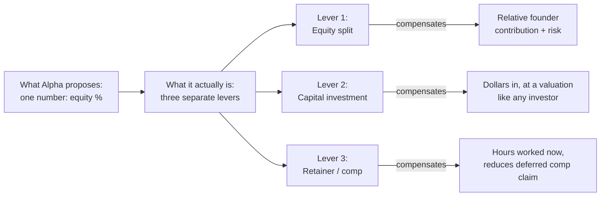
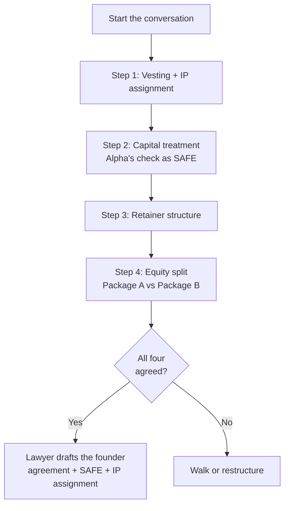

# BEEPBIP — Founder Equity Plan

> **Audience:** You and your co-builder (CPO/COO). **Not** Alpha (the main founder / idea-and-capital co-founder). This is an internal strategy document to align the two of you *before* the equity conversation.
> **Status:** Draft for internal review. Do not circulate.
> **Last updated:** 2026-05-02.

---

## 0. TL;DR

1. **Your opening position: 60 / 20 / 20** with full vesting on all three founders, IP assignment conditional on signed cap table, Alpha's check documented as a **founder SAFE** (not as an equity bump), and a **market-rate retainer** for you two while part-time.
2. **Your fallback: 65 / 17.5 / 17.5.** Still lands each of you at ~10% post two rounds — the floor for "technical co-founder," not "founding engineer."
3. **Your red line: 70 / 15 / 15.** Below this, you are being hired as founding employees with a shiny title, not offered founder equity. Walk or restructure the deal (see §10).
4. **The three non-equity terms that matter more than 5 points of cap table:**
   (a) **4-year vesting with a 1-year cliff on all three founders** (including Alpha),
   (b) **IP assignment of the existing code is withheld until the cap table is signed**,
   (c) **Alpha's money comes in as a founder SAFE at the same cap as outside investors**, not as a reason to take more equity at founding.
5. **Do not negotiate split first.** Sequence: vesting + IP → capital treatment → retainer → split. By the time you get to the split, half of Alpha's argument has been answered by other terms.

---

## 1. The situation we're actually in

| Fact | Implication |
|---|---|
| All three founders are **part-time** | Idea premium matters less; relative hours matter more. "I'm the CEO full-time" arguments don't apply here. |
| Alpha brings **idea + $25–150K check + fundraising network + other businesses** | Valuable, but not a 3x–10x multiplier over the other two. Network/CEO premium is ~5–10 points, not 50. |
| You and partner brought **100% of the code, product, and ops work so far** | You are not "engineers Alpha hired" — you are co-builders of the thing that exists today. |
| **MVP code has not yet been assigned to the LLC** | This is your single biggest piece of negotiating leverage today. Do not give it up before the cap table is signed. |
| Alpha is **self-proposing** the split he benefits from | Normal and rational on his side, but it means the burden is on you to bring your own framework, not just react to his. |
| You and partner have **day jobs** | You can walk. Alpha cannot easily replace two technical co-founders working part-time for equity + retainer. |

---

## 2. The core reframe: three things, not one

Alpha's proposal collapses three independent levers into one number ("equity split"). Separating them is the single most valuable move in this negotiation.



| Lever | What it's for | How it should be priced |
|---|---|---|
| **Equity split** | Long-term ownership reflecting who built this | Founder contribution framework (see §4) |
| **Capital investment** | Alpha putting money in | Founder SAFE, same terms as outside investors (cap + discount). Separate line on the cap table. |
| **Retainer** | Compensates current-month hours while part-time | Hourly market rate, converts to salary post-funding, unpaid amount accrues as deferred comp |

**If these three are collapsed into one number, Alpha wins by default** — because "idea + money + hustle" sounds like it justifies 80%, when in reality idea justifies ~10 points, money is priced separately at a valuation, and hustle is ~5–10 points.

---

## 3. The math: what each split actually leaves you with

### 3.1 Dilution assumptions (industry-standard for a SoHo-stage SAFE → Seed)

| Round | Dilution | Notes |
|---|---|---|
| Pre-seed SAFE (the $600K ask) | ~18% | Assumes $600K on a ~$3.3M post-money cap; post-conversion dilution lands ~18% |
| Option pool refresh pre-seed | ~10% | Investors typically require a 10% unallocated pool; comes out of founders |
| Series Seed / A | ~22% | $2–4M on $10–15M post; average dilution at this stage |
| Option pool top-up at Seed | ~5% | Post-seed pool refresh, also from founders |

**Combined founder-equity multiplier after 2 rounds:**

```
(1 − 0.10) × (1 − 0.18) × (1 − 0.05) × (1 − 0.22) ≈ 0.548
```

So every founder keeps **~55%** of their starting equity after two rounds + two pool refreshes. This is slightly aggressive on the dilution side, which is the honest way to plan.

### 3.2 Dilution table — what each proposal actually produces

| Starting split | After SAFE + pool | After Seed + pool | You (each) keep |
|---|---|---|---|
| **60 / 20 / 20** (your proposal) | 44.3 / 14.8 / 14.8 | **32.9 / 11.0 / 11.0** | **~11% each** |
| **65 / 17.5 / 17.5** (your fallback) | 48.0 / 12.9 / 12.9 | **35.6 / 9.6 / 9.6** | **~9.6% each** |
| **70 / 15 / 15** (your red line) | 51.7 / 11.1 / 11.1 | **38.4 / 8.2 / 8.2** | **~8.2% each** |
| **75 / 12.5 / 12.5** | 55.4 / 9.2 / 9.2 | **41.1 / 6.8 / 6.8** | **~6.8% each** |
| **80 / 10 / 10** (Alpha's implied ask) | 59.1 / 7.4 / 7.4 | **43.9 / 5.5 / 5.5** | **~5.5% each** |

Alpha's "you'll end at 5–7%" claim is **only true if you start at ~75–80%**. That number does not reconcile with "co-founder who built the entire product." It reconciles with "founding engineer with a generous package," which is a different job.

### 3.3 Benchmarks — what the market does for technical co-founders

These are ranges reported by Carta, AngelList, and Kauffman Fellows in their founder-equity datasets (not verifiable citations — use as directional):

| Role | Typical founding equity | Typical post-Series-A equity |
|---|---|---|
| Solo founder / CEO | 50–80% | 25–40% |
| **Technical co-founder (builds the product)** | **20–35%** | **10–18%** |
| Second non-technical co-founder | 15–30% | 8–15% |
| First senior engineer (hired, not founder) | 1–3% | 0.4–1.5% |
| "Founding engineer" title but post-incorporation | 2–5% | 1–2.5% |

Your proposed 20% each is **on the low end of the co-founder range**. Alpha's implied 10% each is **on the high end of the founding-engineer range, below the co-founder range entirely**. That is the crux of the disagreement.

### 3.4 Part-time-everyone adjustment

The conventional "idea + CEO premium" math assumes the CEO is full-time and the technical co-founders are also full-time. In your case:

- **Alpha is part-time** → his CEO premium should shrink, not grow, because he is not full-time-running the company.
- **You and partner are part-time** → your contribution is capped at your hours, but so is his.
- **The only resource that compounds during part-time is code written and businesses signed** — both of which are 100% you and partner so far.

This is the reason a modified Slicing-Pie style "contribution-weighted" view lands at roughly the same **55–60 / 20–22.5 / 20–22.5** range that your gut proposed. Your instinct is supported by the math; Alpha's is not.

---

## 4. Honest contribution table

Fill this in together with your partner before the conversation. Alpha may disagree with weights — that's fine; the point is to force *every* claim into a column that can be argued on its merits.

| Contribution | Weight (out of 100) | Alpha | You | Partner |
|---|---:|---:|---:|---:|
| Original idea | 10 | 10 | 0 | 0 |
| Domain expertise (SoHo, marketplace, commerce) | 5 | ? | ? | ? |
| Code written / architecture decisions to date | 25 | 0 | ? | ? |
| Product + UX decisions to date | 10 | ? | ? | ? |
| Ops / legal / entity setup | 5 | ? | ? | ? |
| Fundraising ownership (relationships, pitch, closing) | 15 | 15 | 0 | 0 |
| CEO responsibility going forward | 10 | 10 | 0 | 0 |
| Capital invested (priced separately — **do not double-count here**) | 0 | 0 | 0 | 0 |
| Hours/week committed next 18 months | 15 | ? | ? | ? |
| Risk taken (day-job foregone, personal reputation, personal guarantees) | 5 | ? | ? | ? |
| **Totals** | **100** | | | |

**Rules for filling this in:**
- The *capital* row is deliberately 0 in the equity weights — Alpha's money is priced via the SAFE in §6.3, not here.
- The *fundraising* and *CEO* rows are generously weighted to Alpha. Do not argue these down.
- The *code / product / ops* rows are where you honestly claim your weight. Don't undersell — if you wrote 100% of the code, put 100% in that row for you and partner.
- The *hours/week* row is where the part-time-everyone reality shows up. If Alpha commits 10 hrs/wk and you each commit 15 hrs/wk, the column totals there should reflect that.

When you run the numbers honestly, Alpha lands around 50–58%, each of you lands around 20–22%. **That matches your 60/20/20 proposal, and gives you a principled rationale to walk in with.**

---

## 5. What Alpha's counter-offer is actually signaling

Three possible interpretations, each with a different counter-move:

1. **He's mis-benchmarked against "founding engineer" equity (1–5%).**
   *Counter-move:* Bring §3.3 to the conversation. Make clear that 5–7% end-state is founding-engineer, not co-founder, and you are being asked to take co-founder risk (no salary, IP assignment, full vesting) without co-founder equity.

2. **He's planning to hire a "real CTO" post-funding and views you as transitional.**
   *Counter-move:* This is the scariest interpretation because it means he is not fully bought into you as permanent co-founders. Address it directly. Ask: *"Are we co-founders permanently, or are we bridge talent until you hire out?"* If the answer is bridge talent, you should know now and negotiate as bridge talent (higher retainer, lower equity, explicit exit package). But that's a different deal than what's on the table.

3. **He genuinely believes idea + capital + raising money = most of the value created.**
   *Counter-move:* The §2 reframe is the entire answer. Idea is one row on the contribution table. Capital is priced as a SAFE. Raising money is CEO premium. Each is worth 5–15 points, not 50.

Before the conversation, decide together which one you think it is. That tells you which counter-move to lead with.

---

## 6. Non-split terms that matter more than 5 points of cap table

A clean 60/20/20 with terrible governance can become 60/5/5 in practice via founder firings, no vesting protection, and hidden capital-for-equity swaps. A 65/17.5/17.5 with the following terms is worth more than a 70/15/15 without them.

### 6.1 Vesting — non-negotiable, on all three

- **4-year vest, 1-year cliff, monthly vesting thereafter.**
- **Applies to Alpha equally.** No "founder already vested" carve-outs. Alpha has done zero months of full-time work on this company; his cliff starts now.
- **Reverse vesting on founder shares:** any founder who leaves voluntarily in the first 24 months forfeits unvested shares back to the company. Protects all three of you against one person walking with dead equity.

### 6.2 IP assignment — your single biggest lever *today*

The MVP code sits on your laptops. Until you sign an **Invention Assignment Agreement** or **Contribution Agreement** assigning it to the Florida LLC, the LLC does not own its own product.

- **Do not sign IP assignment until the cap table is signed and certified copies of the operating agreement are in hand.**
- This is not a threat — it's hygiene. You are not refusing to assign IP; you are aligning the assignment with the equity grant that pays for it.
- Legally, this is one of the **only** pieces of leverage a technical co-founder gets. Use it once, professionally, now. Lose it the minute you sign.
- **After** the cap table is signed, assign everything immediately and without reservation. You want a clean company post-signing.

### 6.3 Alpha's capital — SAFE, not equity bump

If Alpha is putting in $100K, that money gets treated the same way an outside investor's money would:

- **Founder SAFE at the same cap as the outside round.** If the outside SAFE cap is $3.3M post, his $100K is $100K at $3.3M post → ~3% post-conversion.
- **Alternative:** a priced "founder capital" class at the same per-share price the outside round implies. Same math.
- **Not acceptable:** "Alpha gets an extra 10% of founding equity because he put in money." That double-counts: he gets equity for being founder *and* equity for capital, priced at zero (since pre-SAFE valuation is effectively zero). That is a ~3x overpayment for his check.
- **Optional middle ground:** a small, visible "founder capital premium" on the cap table — e.g., +1% of founding equity per $50K invested, capped at +3%. This rewards his willingness to write the check without pretending his $100K is worth 10+ points of a company that, once raised, will be worth $3M+. Make it a visible line item, not a hidden adjustment baked into his 80%.

### 6.4 Retainer — what you get paid *today* to reduce what you're owed *later*

While you're part-time, you should be paid something real per month. This:

- Reduces the "deferred comp" claim you'd otherwise have against the company.
- Signals Alpha is betting cash on you, not just equity promises.
- Makes clear you are contributing actual hours, not hobby-time.

Target structure:
- **$4,000–$8,000 per month each** while part-time (scale to market hourly for senior PM/eng in NYC: ~$100–150/hr × 40–50 hrs/month).
- **Paid from the SAFE proceeds**, not from Alpha's personal pocket (so it's company expense, not a personal favor).
- **Converts to market-rate salary automatically on "full-time trigger"**: when any founder goes full-time, their retainer converts to a W-2/contractor salary equivalent to market rate for the role (e.g., $150–180K for a CTO/CPO at seed stage), with the delta vs. current retainer defined up front so there is no future negotiation.
- **Unpaid retainer accrues as deferred comp**, repayable at Series A close or acquisition, whichever comes first.

### 6.5 Board composition & protective provisions

- **Board (pre-seed):** 3 seats, one per founder. Majority rules on operational decisions.
- **Board (post-seed):** 3 seats + 1 investor seat = 4. Moves to 5 at Series A (2 founders, 1 investor, 2 independents).
- **Protective provisions (require unanimous founder consent, pre-investor-seat):**
  - Issuing new equity or changing the cap table
  - Sale / merger / acquisition of the company
  - Firing a founder or materially changing their role
  - Changing founder compensation or retainer structure
  - Taking on debt or lines of credit over $50K
  - Changing the company's state of incorporation or legal structure
- **Post-investor-seat:** these become super-majority (2-of-3 founders + investor not opposing) to avoid gridlock, but firing a founder or changing their comp stays unanimous-founder-only.

### 6.6 Acceleration

- **Double-trigger acceleration** on change of control: if the company is acquired *and* a founder is terminated without cause within 12 months, remaining unvested shares accelerate. Standard.
- **Single-trigger acceleration on death/disability** for all three founders.
- **No single-trigger on acquisition.** Standard investor request to keep this out; don't fight it.

### 6.7 Option pool carve-out

- **10% unallocated option pool pre-SAFE**, created before the outside round priced, so all three founders share the dilution proportionally.
- Investors will ask for this; doing it yourselves *before* they ask means it doesn't get loaded onto Alpha's 60% only (which would be the outcome if he negotiates it later as "founder dilution").
- Keeps your final numbers aligned with the §3.2 table.

### 6.8 "Full-time trigger" — the clause that removes the next year's fight

Write into the founder agreement: when any founder goes full-time on BEEPBIP:

- Their retainer converts to pre-agreed market salary automatically.
- No re-negotiation of equity split. Going full-time was always the plan; it's not a new contribution that earns new equity.
- If Alpha goes full-time first, he doesn't get more equity for it. If you go full-time first, you don't either.

This removes the single most common fight in part-time-founder cap tables.

---

## 7. Packaged proposals to bring to Alpha

Do not offer one number. Offer two packages. Let Alpha pick. He gets to feel in control; you get to control the floor.

### Package A — "Fair and simple" (your preference)

- **60 / 20 / 20** founding equity
- 4-year vest, 1-year cliff, all three
- Alpha's $X capital in as a founder SAFE at the outside-round cap (visible separate line on cap table)
- Retainer: $6K/month each to you and partner, $0 to Alpha
- 10% option pool pre-seed
- Protective provisions as §6.5, unanimous founder consent on the listed items

### Package B — "Alpha-tilted with protections" (your fallback)

- **65 / 17.5 / 17.5** founding equity
- 4-year vest, 1-year cliff, all three
- Alpha's $X capital in as a founder SAFE at the outside-round cap, **plus** a +1% founder-capital premium per $50K invested (visible), capped at +3%
- Retainer: $5K/month each to you and partner, $0 to Alpha
- 10% option pool pre-seed
- Same protective provisions
- Written "full-time trigger" clause (§6.8)

### What you will NOT offer

- Any split where you each end founding below 15%.
- Any structure where Alpha's capital is traded for equity outside the SAFE.
- Any structure where Alpha does not vest.
- Any structure where IP assignment happens before cap table signing.

---

## 8. Negotiation sequencing



### Why this order

1. **Vesting + IP first:** These are "governance hygiene" that any lawyer would require anyway. Alpha can't object to them without looking unreasonable. Getting a yes on vesting + IP builds momentum and locks in your biggest protection.
2. **Capital treatment second:** Now that his money isn't the whole conversation, it becomes easier to frame as "and of course, your investment comes in as a SAFE at the same cap as outside investors — that's the cleanest way for everyone."
3. **Retainer third:** With SAFE money confirmed, retainer becomes a company expense, not a personal favor from Alpha. Easier yes.
4. **Split last:** By now, three of his objections ("I'm putting in money," "I'm doing the fundraising," "You're only part-time") have been answered by structure. The equity conversation becomes narrow: what's a fair founder split? Bring §4 (contribution table) as the answer.

### Tone

- Analytical, not emotional. Have the numbers on paper.
- Frame each ask as "this is what clean early-stage companies do" — not "this is what we want from you." Cooley GO, Clerky, and YC all have templates that include most of what's in §6.
- Offer to pay for a 1-hour consult with a startup attorney to validate the structure. ($300–500.) Makes the process feel neutral, not adversarial.

---

## 9. Red lines — when to walk or restructure

You walk, or restructure the deal into an employee-style arrangement (higher cash, lower equity, explicit exit terms), if Alpha:

1. **Refuses to vest his own shares.** Full stop. Any founder who won't vest is planning to take equity and leave.
2. **Insists on >70% founding equity** with you each below 15%. That is founding-employee territory, not co-founder.
3. **Refuses to have his check documented as a SAFE with a cap.** He is asking you to discount your equity for capital that he'll later get *additional* credit for as an "investor." Double-dip.
4. **Refuses IP assignment contingent on signed cap table.** He wants the code before the deal. That's the deal being bad.
5. **Insists on unilateral firing rights** over founders. No co-founder agreement survives this clause.
6. **Refuses a written founder agreement**, wants to "keep it informal until funded." That means "I'll rewrite the rules when I have leverage." Paper it now or walk.

If any of these are hit, your alternative is not "take the bad deal." Your alternative is:

- **Walk, keep the code, ship it yourselves.** You have day jobs; you're not starving.
- **Restructure as a contractor agreement:** $12–15K/month each, 3–5% each, explicit 12-month term, code assigned at signing. This is a cleaner version of what Alpha is actually asking for, and it makes the trade explicit.

---

## 10. What to do this week

| # | Action | Owner | Deadline |
|---|---|---|---|
| 1 | Read this doc end-to-end, both of you | You + partner | Day 1 |
| 2 | Fill in §4 contribution table together; agree on column totals | You + partner | Day 2 |
| 3 | Agree: is this Interpretation #1, #2, or #3 from §5? | You + partner | Day 2 |
| 4 | Agree on your Package A and Package B numbers (may differ from the defaults) | You + partner | Day 3 |
| 5 | **Do not sign any IP assignment, contribution agreement, or work-for-hire agreement** | You + partner | Ongoing, until §11 done |
| 6 | Book a 1-hour consult with a startup attorney (Cooley GO referral list, or a Clerky recommendation). Budget $500. | One of you | Day 5 |
| 7 | Send Alpha an email: "We've been thinking through the founder structure; we'd like to put a proposal on the table. Can we meet [date] to walk through it?" Attach §7 only — not this whole doc. | You | Day 5 |
| 8 | Hold the meeting. Follow §8 sequencing. | All three | Day 7–10 |
| 9 | Document agreement in writing *same day*, even as a shared Google Doc. Verbal founder agreements decay within 72 hours. | You | Same day as meeting |
| 10 | Convert to proper founder agreement + SAFE + IP assignment docs via Clerky / Cooley GO / attorney. | All three | Within 14 days of meeting |

---

## 11. What this document will NOT do for you

- **It will not draft a founder agreement, a SAFE, or an IP assignment.** Use Clerky ([clerky.com](https://clerky.com)) or Cooley GO ([cooleygo.com](https://cooleygo.com)) templates, validated by an attorney. Budget $500–$2,000 for initial legal review.
- **It will not tell you whether your specific Alpha is Interpretation #1, #2, or #3.** Only you know him.
- **It will not save the relationship if the numbers above are genuinely incompatible.** If Alpha truly believes you are worth 5% each at founding and nothing will change his mind, the company has a governance problem now, not just a cap-table problem.
- **It will not replace the conversation.** You still have to have the hard conversation. This doc just means you have it with numbers, a framework, and a fallback — instead of feelings, anchoring bias, and a cap table nobody wrote down.

---

## 12. Glossary — terms Alpha may bring up

| Term | What it means | What to watch for |
|---|---|---|
| **SAFE** | Simple Agreement for Future Equity. Converts to equity at the next priced round, using a valuation cap and/or discount. | Make sure Alpha's check is on a SAFE *with a cap*, not uncapped. Uncapped SAFEs are terrible for founders at seed. |
| **Valuation cap** | Maximum company valuation at which the SAFE converts. Lower cap = more equity for the investor. | Alpha's SAFE should be at the *same cap* as outside SAFEs, ideally pooled into one round. |
| **Option pool** | Shares reserved for future employees. Always dilutes founders, not investors. | Create a 10% pool *before* the priced round, so all three of you share the hit proportionally. |
| **Cliff** | The minimum time a founder must work before any shares vest. Standard is 1 year. | Alpha must have the same cliff as you. No exceptions. |
| **Acceleration** | Shares vest faster on certain events (acquisition, termination). | Double-trigger only. Single-trigger is unusual and investors push back. |
| **Protective provisions** | A list of actions that require extra consent (supermajority, unanimous founders, investor veto). | §6.5 is your list. Write them in. |
| **Drag-along / tag-along** | Rules for what happens if the company is sold. | Standard; let the lawyer draft, don't fight it. |
| **83(b) election** | IRS filing within 30 days of receiving founder equity, taxes it at grant rather than vesting. Critical. | All three of you file within 30 days of founding. Miss it and you owe taxes on every vesting tranche at then-current value. |

---

*End of document. Share with your co-builder only. Do not share with Alpha, investors, or anyone external.*
